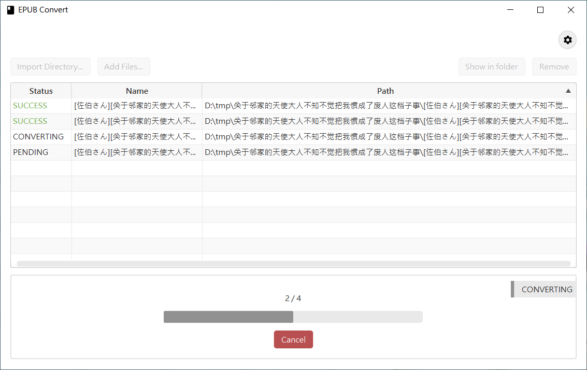

# epub-convert-gui
Convert simplified chinese to traditional chinese in EPUB with JavaFX GUI.  
(2021 NCU CSIE CE-1004-B Final Project)  



## Feature
- Convert EPUB with GUI / Command
- Modern, clear, easy-to-use UI
- Recursively convert EPUBs in directory
- Support Drag and Drop to import files
- Custom Configurations
    - Output Directory
    - Output Filename
    - Overwrite existing file?
    - Minimum alert level

## Requirements
Java verision >= 15.

## Usage
- GUI
    - Run jar without argument to launch GUI.
    - `Import Directory`: scan directory and add EPUB files to queue
    - `Add Files`: add multiple files to queue
    - `Show in folder`: select file in system file manager
    - `Remove`: remove file from list
    - `Convert`: start conversion
    - Drag and Drop: drag file on to the list to import
- Command
    - `java -jar epub-0.1.jar --output ~/epub/output/ --filename TRANSLATE ~/epub/*.epub`
    - See more argument description with `-h` or `--help`.

## Build
Run App with gradle
```
gradlew run
```

Build JAR
```
gradlew jar
```

## Used Libraries
- JavaFX 15.0.1
- [houbb/opencc4j](https://github.com/houbb/opencc4j)
- Apache commons-compress
- Apache commons-cli
- Google GSON
- [TocasUI](https://tocas-ui.com) (CSS styles)
- [Google Font Material Icons](https://fonts.google.com/icons?selected=Material+Icons+Outlined)